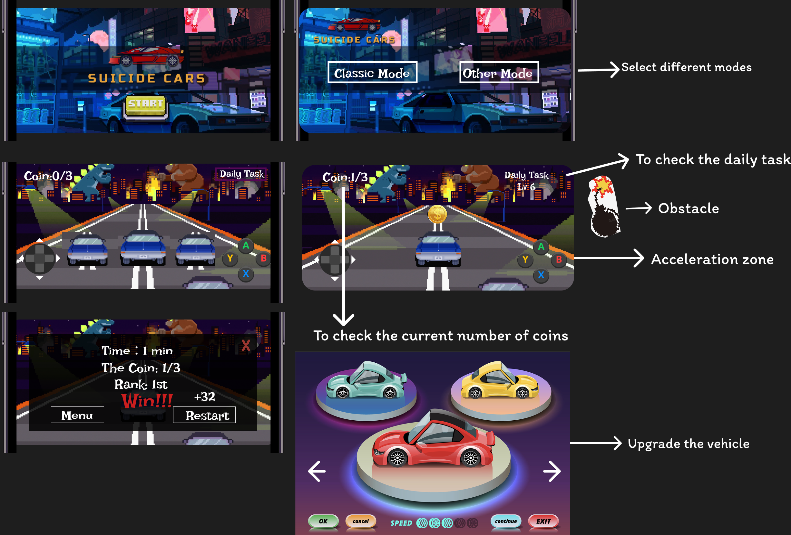

# 🏎️ AI Racing Car Game Enhancement

## 📌 Program Description

Our game's demo is based on an open-source project from GitHub. Starting from the main menu, players can choose between two different modes. During the game, players and AI opponents start on the same track and race against each other. By overtaking the opponents and securing a better rank, players can win the game. We aim to enhance the gameplay experience by introducing **Fuction of driving backwards** , **the ability for the buttons** and **the multiple gameplay**.

---

## 📎 The Game Design

## 👥 Team & Task Division

| Team Member         | Responsibility                                              |
|---------------------|-------------------------------------------------------------|
| **Cassie**  | Implemented the **Car Reversing** feature, **Program description**  and **project prototype** |
| **Sylvia**          | Developed and tested the **Program description** Implemented the **Button Setting**          |
| **Angela**          | Built the **Gameplay Mode**|
| **Alice**           | Designed for the future work and created the **final presentation (PowerPoint)** |

---

## ✅ Getting Started

1. Clone the repo to your disk
2. Open the project in **Unity Editor** (2020.3+ recommended)
3. Add the file from your disk named **"Unity-AI-Racing-cars-with-waypoints 2"** to Unity
4. Open this file in Unity

---

## 📬 Contact

Feel free to reach out if you have questions or ideas!

