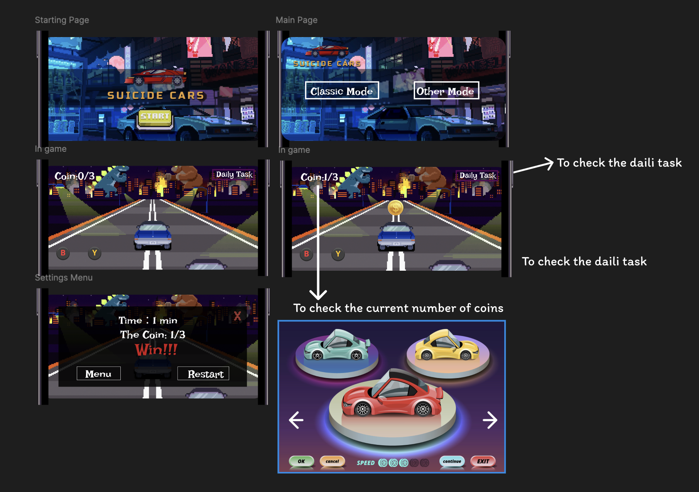

# 🏎️ AI Racing Car Game Enhancement

## 📌 What We're Doing

Our project is based on an AI-powered racing car game. We aim to enhance the gameplay experience by introducing **gold coin collection mechanics** , **the ability for cars to move backward** and **the function that upgrade the vehicle**.

### Key Features:
- 💰 **Coin Collection**: Players can collect coins while racing. A player wins by either:
  - Completing a full lap, **or**
  - Collecting **Target coins**.
- 🔁 **Backward Movement**: To prevent players from getting stuck at borders or tight spots, we added the ability for cars to move in reverse.
- 🚗 **Vehicle upgrade**
  - Use the coin to upgrade the vehicle!

These additions aim to make the game more dynamic, user-friendly, and fun.

---

## 🎯 Why We're Doing This

The original AI racing car game is well-designed and fun to play. However, we believe the experience can be further improved. By allowing players to **collect coins**, **reverse their car** and **upgrade the vehicle**, we provide:

- More **gameplay flexibility**
- A new layer of **challenge and reward**
- Better **Player engagement**

We are excited to experiment with these features and polish the racing experience!

---

## 📎 The Game Design

## 👥 Team & Task Division

| Team Member         | Responsibility                                              |
|---------------------|-------------------------------------------------------------|
| **Cassie**  | Implemented the **car reversing** feature, **Program description**  and **project prototype** |
| **Alice**           | Designed and created the **final presentation (PowerPoint)** |
| **Sylvia**          | Developed and tested the **Program description**           |
| **Angela**          | Built the **coin system**|

---

## 🛠️ Technologies Used
- Unity3D
- C#
- Unity Standard Assets
- GitHub for collaboration

---

## 📸 Screenshots & Demo (Coming Soon)

Stay tuned for gameplay demo videos and screenshots!

---

## 🔄 How to Run

1. Clone the repo:
2. Open the project in **Unity Editor** (2020.3+ recommended)
3. Play the scene `MainScene` to test coin collection and backward driving

---

## 🚧 Future Improvements

- Add audio effects when coins are collected
- Introduce more obstacle types
- Store high scores or coin count across sessions

---

## 📬 Contact

Feel free to reach out if you have questions or ideas!

